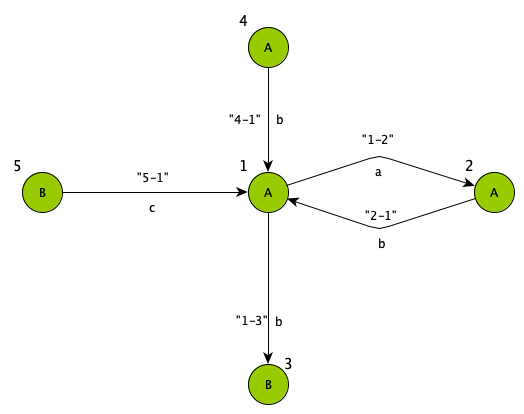

# Graphite

[](https://travis-ci.com/coetaur0/Graphite)
[](https://codecov.io/gh/coetaur0/Graphite)

A Swift library to build and manipulate graphs.

---

## Installation

Graphite is distributed through the [Swift Package Manager](https://swift.org/package-manager/). To use it, simply add it as a 
dependency to your project by inserting the following elements in your `Package.swift` file:

```swift
let package = Package(
  name: "ProjectName",
  dependencies: [
    .package(url: "https://github.com/coetaur0/Graphite.git", .upToNextMajor(from: "0.1.0")),
  ],
  targets: [
    .target(
      name: "ProjectName", dependencies: ["Graphite"]),
  ]
)
```

---

## Usage

### Building a graph

To build a graph with custom labels on its vertices and edges, first define the types of the labels, for example with enums:

```swift
enum VertexLabel {
  case A
  case B
}

enum EdgeLabel {
  case a
  case b
  case c
}
```

Then, instantiate a new graph object parametrized with the types of labels you defined, and add vertices and edges to it:

```swift
let graph = Graph<VertexLabel, EdgeLabel>(named: "Graph")

let vertex1 = graph.addVertex(named: "1", labelledWith: .A)
let vertex2 = graph.addVertex(named: "2", labelledWith: .A)
let vertex3 = graph.addVertex(named: "3", labelledWith: .B)
let vertex4 = graph.addVertex(named: "4", labelledWith: .B)

_ = graph.addEdge(named: "1-2", labelledWith: .a, from: vertex1, to: vertex2)
_ = graph.addEdge(named: "1-3", labelledWith: .b, from: vertex1, to: vertex3)
_ = graph.addEdge(named: "2-1", labelledWith: .a, from: vertex2, to: vertex1)
_ = graph.addEdge(named: "4-1", labelledWith: .b, from: vertex4, to: vertex1)
```

The graph corresponding to the code above looks like this:


### Matching two graphs

To compute the best possible matching between the vertices and edges of your graph and those of another one, first build the 
other graph:

```swift
let otherGraph = Graph<VertexLabel, EdgeLabel>(name: "OtherGraph")

let otherVertex1 = otherGraph.addVertex(named: "1", labelledWith: .A)
let otherVertex2 = otherGraph.addVertex(named: "2", labelledWith: .A)
let otherVertex3 = otherGraph.addVertex(named: "3", labelledWith: .B)
let otherVertex4 = otherGraph.addVertex(named: "4", labelledWith: .A)
let otherVertex5 = otherGraph.addVertex(named: "5", labelledWith: .B)

_ = otherGraph.addEdge(named: "1-2", labelledWith: .a, from: otherVertex1, to: otherVertex2)
_ = otherGraph.addEdge(named: "1-3", labelledWith: .b, from: otherVertex1, to: otherVertex3)
_ = otherGraph.addEdge(named: "2-1", labelledWith: .b, from: otherVertex2, to: otherVertex1)
_ = otherGraph.addEdge(named: "4-1", labelledWith: .b, from: otherVertex4, to: otherVertex1)
_ = otherGraph.addEdge(named: "5-1", labelledWith: .c, from: otherVertex5, to: otherVertex1)
```

The code above produces the following graph, called `OtherGraph`:



Once the other graph has been defined, call the `match(with:)` method with the other graph as argument:

```swift
let matching = graph.match(with: otherGraph)
```

The resulting matching looks something like this:


where the vertices and edges in black are matched through the *red* connections, and those in *gray* are left unmatched.
Notice how vertices or edges with different labels cannot be matched with each other.

The score of a matching between two graphs can be retrieved through its `score` property. It corresponds to the number of 
vertices and edges matched in the two graphs (the red connections in the image) over the total number of vertices and edges
in the graph that called `match` (the graph with blue vertices in the images). The code:

```swift
print("Matching score: \(matching.score)")
```

prints out `Matching score: 0.75`.

The matches between vertices and edges can be accessed though the `vertexMatches` and `edgeMatches` properties of a matching.
Those properties are dictionaries with the vertices and edges of the graph that called `match` as keys, and their matches in
the other graph as values:

```swift
print("Vertices matches:")
for (vertex, match) in matching.nodeMatches {
  print("\t-\(vertex.name): \(match.name)")
}

print("Edge matches:")
for (edge, match) in matching.edgeMatches {
  print("\t-\(edge.name): \(match.name)")
}
```
